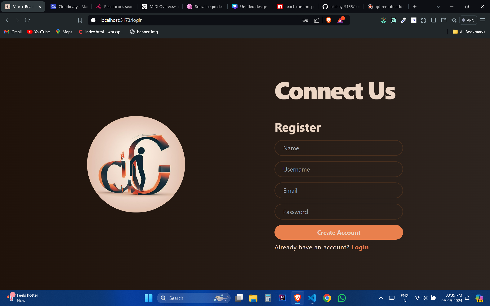
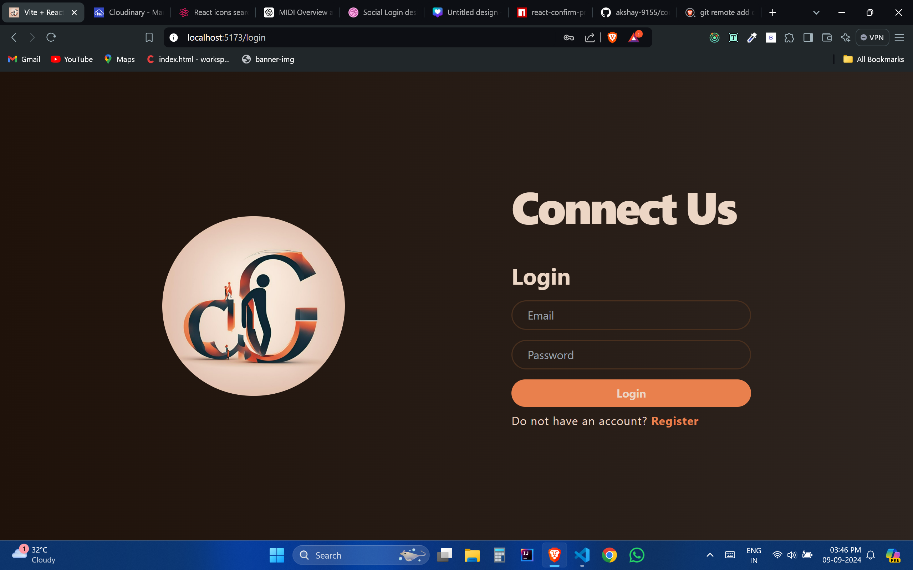
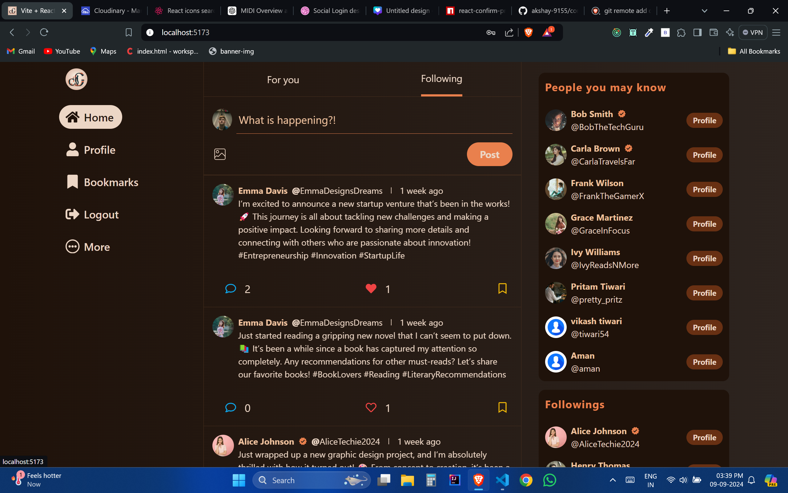
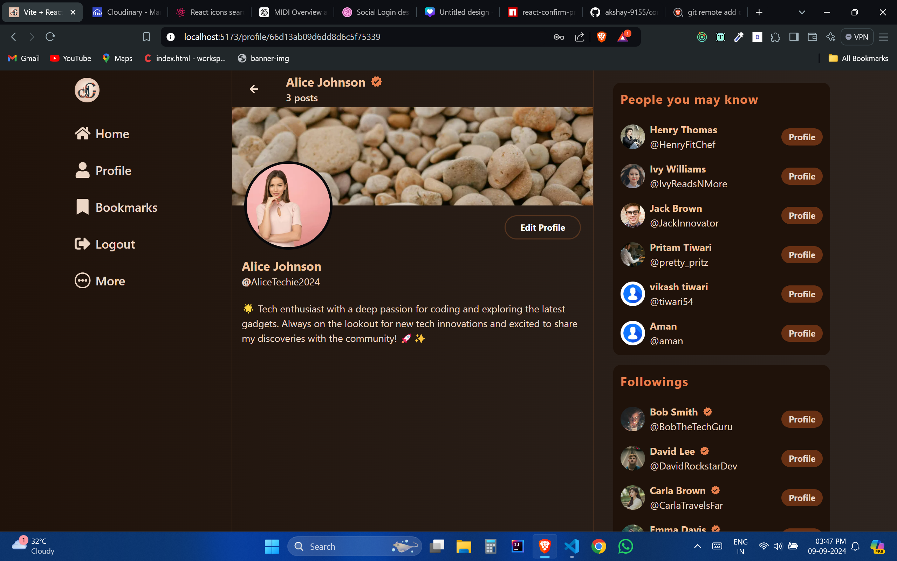

# 📱 CONNECT US - Social Media App - MERN Stack

Welcome to the **CONNECT US**, a full-stack social networking platform built with the **MERN (MongoDB, Express, React, Node.js)** stack. This app allows users to connect, share, and interact with posts, comments, and likes, offering a seamless social media experience.

---

## 🚀 Features

- **User Authentication**: Secure user registration and login with JWT authentication.
- **Post Creation & Interaction**: Users can create, edit, and delete posts, as well as like, comment, and reply to other users’ posts.
- **Real-time Updates**: Stay updated with live posts and comments using websockets (or long-polling).
- **Profile Management**: Customize profiles with bio, profile picture, and personal details.
- **Follow & Unfollow**: Discover and follow other users.
- **Responsive Design**: Optimized for both desktop and mobile devices.

---

## 🛠️ Technologies Used

### Frontend:

- **React.js**: A dynamic user interface built with React and hooks.
- **Redux**: For state management across the application.
- **React Router**: Navigation between different components.
- **Tailwind CSS**: Utility-first CSS framework for rapid UI development.

### Backend:

- **Node.js**: JavaScript runtime environment for server-side logic.
- **Express.js**: Fast and lightweight web framework for building APIs.
- **MongoDB**: NoSQL database for storing user data, posts, and comments.
- **Mongoose**: Object Data Modeling (ODM) library for MongoDB.

### Authentication:

- **JWT (JSON Web Tokens)**: For secure authentication and session management.

### Cloud Services:

- **Cloudinary**: For image storage and management.
- **Vercel**: For backend and frontend deployment.

---

## 📸 Screenshots

### Register Page



### Login Page



### Home Page



### Profile Page



---

## ⚙️ Installation & Setup

### Prerequisites:

- **Node.js** and **npm** installed on your system.
- **MongoDB** installed or access to a cloud-based MongoDB instance.

### Backend Setup:

Navigate to the backend folder:

```bash
cd backend
```

Install dependencies:

```bash
npm install
```

Create a .env file for environment variables:

```bash
touch .env
```

Add the following variables to the .env file:

```bash
PORT=port_number
MONGODB_PASSWORD=your_mongodb_password
MONGO_URI=your_mongo_db_uri
JWT_SECRET=your_secret_key

CLOUDINARY_CLOUD_NAME=your_cloudinary_name
CLOUDINARY_API_KEY=your_cloudinary_api_key
CLOUDINARY_API_SECRET=your_cloudinary_api_secret
```

Start the backend server:

```bash
npm run dev
```

### Frontend Setup:

Navigate to the frontend folder:

```bash
cd ../frontend
```

Install dependencies:

```bash
npm install
```

Install Tailwind CSS by following [Tailwind Setup Guide](https://tailwindcss.com/docs/guides/vite).

Start the frontend server:

```bash
npm run dev
```

## Access the App

- **Frontend**: Visit [http://localhost:5173](http://localhost:5173) in your browser.
- **Backend**: The backend runs on [http://localhost:8080](http://localhost:8080) by default.

🌐 **Live Demo**

You can check out the live version of the app here: [Live Demo](URL_OF_LIVE_DEMO) <!-- Add deployed url -->

## 🤝 Contributing

#### Contributions are welcome! If you'd like to contribute to the project, follow these steps:

- Fork the project.
- Create your feature branch: git checkout -b feature/AmazingFeature.
- Commit your changes: git commit -m 'Add some AmazingFeature'.
- Push to the branch: git push origin feature/AmazingFeature.
- Open a pull request.

## 🙌 Acknowledgements

### Special thanks to all the contributors and open-source libraries that made this project possible.

## 📚 Project Structure

### Here’s a quick overview of the project structure:

```bash
socialMediaApp/
│
├── backend/             # Backend (Node.js/Express) code
│   ├── config/          # Configuration (e.g., database)
│   ├── controllers/     # Route logic
│   ├── models/          # Mongoose schemas (User, Post, Comment)
│   ├── routes/          # API routes
│   ├── utils/           # Utility functions (e.g., JWT handling)
│   ├── public/          # temporarily store images
│   ├── app.js           # middlewares and APIs call
│   |── index.js         # Entry point for the backend server
│   └── .env             # Environment variables
│
├── frontend/            # Frontend (React.js) code
│   ├── public/
│   ├── utils/           # constants.jsx
│   ├── src/
│   │   ├── assets/
│   │   ├── components/  # React components
│   │   ├── redux/       # Redux slices, actions, reducers
│   │   ├── hooks/       # custom hooks
│   │   ├── App.js
│   │   ├── index.css
│   │   ├── main.js      # Root component
│   │   └── index.html     # Entry point for the React app
│   └── tailwind.config.js # Tailwind CSS configuration
│
├── package.json         # npm dependencies
└── README.md            # Project documentation

```

## ✨ Features Overview

- **Authentication**
  - JWT-based authentication to handle secure login and signup.
  - Passwords are hashed using bcrypt for security.
- **Post Management**
  - Users can create, edit, delete, and like posts.
  - Posts can include text and images (uploaded to Cloudinary).
- **Commenting & Replies**
  - Nested comment structure with users able to comment and reply to posts.
  - Users can like and delete comments.
- **Follow & Feed System**
  - Follow system where users can follow/unfollow others.
  - A personalized feed showing posts from followed users.

## 📝 Todo

- Add notifications for likes, comments, and follows.
- Add search functionality.
- Implement real-time chat.

## 🧑‍💻 Future Improvements

- Real-time Features: Add WebSocket support for real-time notifications.
- Story Feature: Allow users to post time-limited "stories."
- PWA Support: Make the app installable as a Progressive Web App (PWA).
